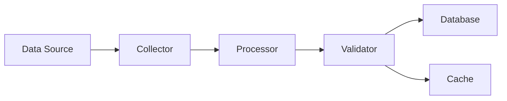
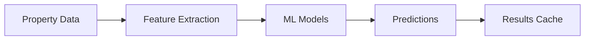
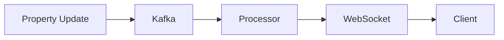

# MidcoastLeads System Architecture

## Overview
The MidcoastLeads system is a distributed, event-driven architecture designed for scalable property data processing and analysis.

## Core Components

### 1. Data Processing Pipeline
```
[Data Sources] → [Collectors] → [Processors] → [Validators] → [Storage]
```

#### Key Components:
- **Collectors**: Extract data from various sources
- **Processors**: Clean and transform data
- **Validators**: Ensure data quality
- **Storage**: Persist processed data

### 2. Analytics Engine
```
[Property Data] → [Feature Extraction] → [ML Models] → [Predictions]
```

#### Features:
- Price prediction
- Market trend analysis
- Risk assessment
- Investment scoring
- Development potential analysis

### 3. Real-time Processing
```
[Events] → [Kafka] → [Processors] → [WebSocket] → [Clients]
```

#### Components:
- Event streaming
- Message queuing
- Real-time notifications
- WebSocket server

### 4. Infrastructure
```
[API Gateway] → [Load Balancer] → [App Servers] → [Databases]
```

#### Services:
- PostgreSQL database
- Redis cache
- Kafka message broker
- Prometheus monitoring
- Grafana dashboards

## Data Flow

### 1. Property Data Processing


### 2. Analytics Pipeline


### 3. Real-time Updates


## Security Architecture

### 1. Authentication
- JWT-based authentication
- Role-based access control
- Token refresh mechanism

### 2. Data Protection
- Encryption at rest
- TLS for data in transit
- Regular security audits

### 3. API Security
- Rate limiting
- Request validation
- CORS configuration

## Deployment Architecture

### 1. Container Orchestration
```
[Kubernetes Cluster]
├── App Pods (3+)
├── Database Pods
├── Cache Pods
└── Message Broker Pods
```

### 2. Scaling Strategy
- Horizontal pod autoscaling
- Database connection pooling
- Cache sharding
- Event stream partitioning

### 3. High Availability
- Multi-AZ deployment
- Database replication
- Cache redundancy
- Load balancing

## Monitoring Architecture

### 1. Metrics Collection
```
[App Metrics] → [Prometheus] → [Grafana]
```

### 2. Logging
```
[App Logs] → [Fluentd] → [Elasticsearch] → [Kibana]
```

### 3. Tracing
```
[Request] → [OpenTelemetry] → [Jaeger]
```

## Development Workflow

### 1. Local Development
```
[Code] → [Tests] → [Docker Compose] → [Local K8s]
```

### 2. CI/CD Pipeline
```
[GitHub] → [Actions] → [Tests] → [Build] → [Deploy]
```

### 3. Release Process
```
[Feature Branch] → [PR] → [Review] → [Merge] → [Deploy]
```

## Configuration Management

### 1. Environment Configuration
- Development
- Staging
- Production
- Testing

### 2. Secret Management
- AWS Secrets Manager
- Kubernetes Secrets
- Environment variables

### 3. Feature Flags
- Feature toggles
- A/B testing
- Gradual rollouts

## Backup and Recovery

### 1. Database Backups
- Daily full backups
- Point-in-time recovery
- Cross-region replication

### 2. Disaster Recovery
- Recovery point objective (RPO)
- Recovery time objective (RTO)
- Failover procedures

## Performance Optimization

### 1. Caching Strategy
- Application cache
- Database cache
- CDN caching

### 2. Query Optimization
- Index optimization
- Query planning
- Connection pooling

### 3. Resource Management
- CPU limits
- Memory limits
- Storage quotas
